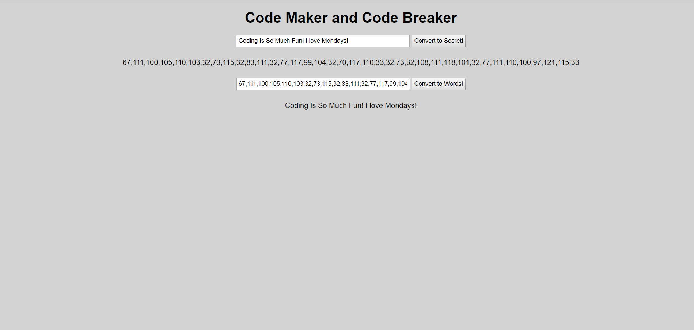

# Code Maker and Code Breaker

## Description
You have been tasked to make an app that will take text and encode it into a secret. Your app should also be able to decode secrets that are entered.

## Screenshots


## How to run this project
* Use npm to install http-server in your terminal:
```sh
npm install -g http-server
```
* Run the server in your terminal
```sh
hs -p 9999
```
* Open chrome and navigate to:
```
localhost:9999
```

## Contributors
[Maggie Leavell](https://github.com/mjleavell)